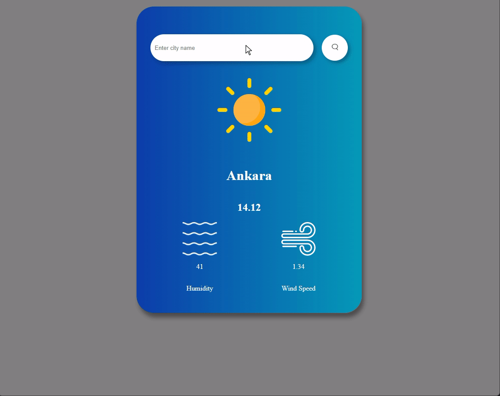

# Hava Durumu Uygulaması

Bu basit hava durumu uygulaması, kullanıcının belirli bir konumun hava durumu bilgilerini görüntülemesine olanak tanır.

## Kullanım

1. **Ana Ekran:**
   - Uygulama başlatıldığında, kullanıcıya hava durumu bilgilerini görüntülemek için bir arama alanı sunulur.

2. **Konum Arama:**
   - Arama çubuğuna şehir adı veya konumunuzu ifade eden bir kelime yazın.
   - Arama sonucunda, hava durumu bilgileri ekranda görüntülenir.

3. **Hava Durumu Bilgileri:**
   - Hava durumu bilgileri, seçilen konuma göre sıcaklık, nem oranı, rüzgar hızı ve diğer temel bilgileri içerir.

## Teknolojiler

- HTML
- CSS
- JavaScript

## API Kullanımı

Bu uygulama, hava durumu verilerini sağlamak için [OpenWeatherMap API](https://openweathermap.org/api) kullanmaktadır.
